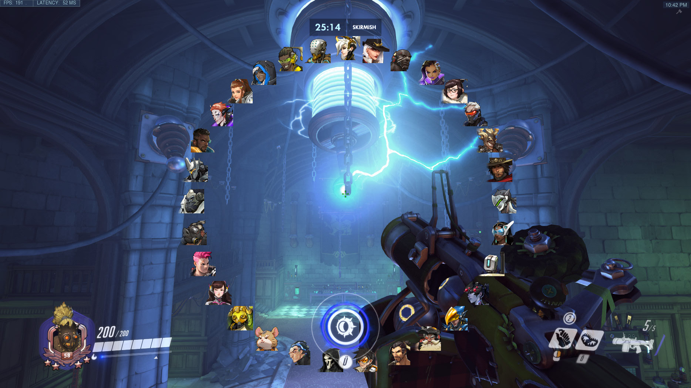

# Radial Menu for Overwatch-Workshop

This Workshop code lets you open a radial menu that shows all your allowed heroes. From there you can switch one of the heroes. 
It is also possible to rewrite it so that anything can be displayed and any action can be performed when selecting a menu item.

Here is a preview for different numbers of items: 

Features:
- Only shows the allowed heroes of the player
- Menu scales depending on the number of items
- Menu follows player when moving. This allows you to change heroes while walking and flying
- Menu follows your reticle so it doesn't leave the screen. Meaning 360 hero switches are possible
- Animated opening/closing sequence
- Displayed heroes are sorted by type (Support,Tank,Damage)
- Works with multiple players

Known Issues:
- Menu doesn't work in multiplayer:  
This is caused by the limitations of the Workshop. The menu displays a lot of InWorldTexts, which are limited to only 128 at a time. Keep this in mind and try limiting the number of players
